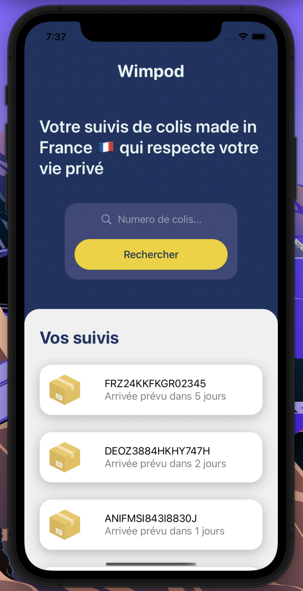

# Wimpod en SwiftUI

[Wimpod](https://github.com/444ldx/wimpod-bot-parcel-tracker) est un bot Discord de suivis de colis développé en Python. Il permet de récupérer le suivis complet d'un colis grâce à l'API officiel de La Poste.

Dans le cadre de mon apprentissage du SwiftUI afin de développer des applications iOS, j'ai réalisé une version *front-end* sans *back-end* de ce que pourrait donner ce bot adapté en application mobile.

## Maquette Figma

J'ai dans un premier temps créé une maquette sur le logiciel Figma afin de me permettre de coder l'application en SwiftUI par la suite. Elle m'a permit d'imaginer la charte graphique de cette application fictive.

## Application finale

J'ai donc ensuite développé l'application mobile à l'aide du logiciel Xcode édité par Apple et utilisé les *icons systems* et la police basique d'iOS. Nous pouvons en effet remarquer une légère différence entre la maquette et la solution finale cependant la disposition des éléments ainsi que leur style a été respecté. La section *Vos Suivis* est d'ailleurs une *ScrollView* afin d'afficher un nombre infinit de suivis.

## Conclusion

Ce projet m'a permit de découvir en 4 heures seulement les bases du SwiftUI pour le développement d'applications mobiles sur iOS. Le logiciel ainsi que le language sont très intuitifs pour les débutants. 
